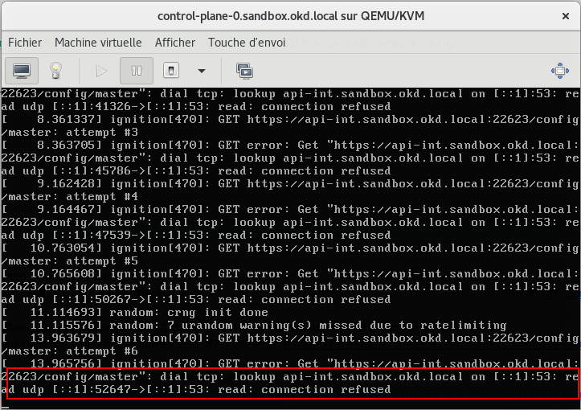
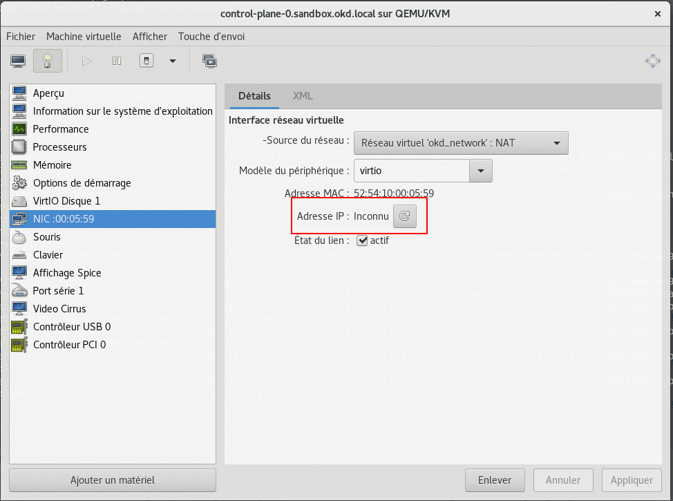

# OKD 4 local installer

## What is it

**okd**, **local installation**, **libvirt**, **one services (dns, lb) machine**, **one bootstrap**, **one control plane (master)**, **one worker**

## References

> https://github.com/cgruver/okd4-single-node-cluster
>

## How to

> build using **mvn clean install**
>
> run it by launching **build_and_run_local.sh**
>

## Issues

### Unable to push image into the docker registry used in *services* Virtual Machine.

> Affect all current OKD 4.6.x
>
> https://github.com/openshift/okd/issues/402

### Network master configuration with network ignition

> The master ignition use the merge feature to get a part of it from the bootstrap server.
> 
> The url used need to use the dns entry from the dns resolver present in *service* virtual machine.
>
> Static Network setup is defined in the ignition file.
> 
> ## Static network is not defined so virtual machines presents in the same network are not reachable. Hence, merge is not resolvable, not reachable.

```json
{
   "ignition":{
      "config":{
         "merge":[
            {
               "source":"https://api-int.sandbox.okd.local:22623/config/master",
               "verification":{
                  
               }
            }
         ],
         "replace":{
            "verification":{
               
            }
         }
      },
      "proxy":{
         
      },
      "security":{
         "tls":{
            "certificateAuthorities":[
               {
                  "source":"data:text/plain;charset=utf-8;base64,LS0tLS1CRUdJTiBDRVJUSUZJQ0FURS0tLS0tCk1JSURFRENDQWZpZ0F3SUJBZ0lJQnIwWDR3RllVYWN3RFFZSktvWklodmNOQVFFTEJRQXdKakVTTUJBR0ExVUUKQ3hNSmIzQmxibk5vYVdaME1SQXdEZ1lEVlFRREV3ZHliMjkwTFdOaE1CNFhEVEl3TVRJeE5URTRNemN4TmxvWApEVE13TVRJeE16RTRNemN4Tmxvd0pqRVNNQkFHQTFVRUN4TUpiM0JsYm5Ob2FXWjBNUkF3RGdZRFZRUURFd2R5CmIyOTBMV05oTUlJQklqQU5CZ2txaGtpRzl3MEJBUUVGQUFPQ0FROEFNSUlCQ2dLQ0FRRUFvK0JoMUNnTlZhVUgKakJpQnBZZzZMT1lJb21mR0xuZVZLbTI0d1pkdCt2NEZuRXRKcW54OGNDNEJvZzZ4SG5KMGl2bzgwR3IrSGhZZwozT0xOaFc2SGhnZkh1b2hOa0ZCVlpGUWFHWkowRWQ5L0diZGJnbnlSdkdPNmlYbVgwbmVQdmMrTG93RDEvK1JsCm9EU2pNNDR0UDA4OTYzVndTL0FkYmFXOEkwTy9XS1dpVFgxMVJreU1mZHkwNjBCRFIxd1ZvUUdTKzF6eVN4WS8KQ2N2YTRWUVR5QTRqbVhPWmNQZjFSSkNIajdJN3pwQytESkRBYVkrNHplbWtzRzAwc0dNb3lCU3hOR2lmSWlwQwpXWW1qNUZxWk1CNWl2VzFSaEFaRFBnUHBRQnN1c1B2dU94T0dIY0FBWTcrdVhsV1hSNk92MFUvNUpCeExveTNFCjBIYzN1dHV2WndJREFRQUJvMEl3UURBT0JnTlZIUThCQWY4RUJBTUNBcVF3RHdZRFZSMFRBUUgvQkFVd0F3RUIKL3pBZEJnTlZIUTRFRmdRVU9udjFXY3FZR29WMFMvWW4rVWxGVmM5WDN2Z3dEUVlKS29aSWh2Y05BUUVMQlFBRApnZ0VCQUl3UC9ucUhpbXFZVUdoRnljSEJoZXpnTytvUHEyNWhIQTlWelFpTEYzNThVazRzWlRZRGQ4bDFieU01CnMyT0cvRy9yNGEvWGNFWTFacVh0SEZleVhoRUJ3bUNZNjR1dDFLZlF1L2hKKzdqMXdnZC9qMGFRVEFHWGRBMGoKR2VjNitiK1FaK1RuL3NRZU9YdDJxb1kwZGNvMzhGWE0rcEFLVFZBMUhUUWIrYWN5RitJQS9BWlczU2tJc2QwSApFbFRhVDhFR2p2TG1sbW4wUmQwcVlaODBsNm5lTUNBUUdOZjNpanNxeFhGTVo5WDQzcHgyVzZjd0FtTzJZQlYrCnVjRm4zWDhOeUFENUFoQWo3N0ZqbkF2TVc4QXFwWnZ1MXYyMG1LUTVySVY3aVp6VHpMQmdISVRDQVpyWU92TmcKMWhkUU84NDNPelI3dHpSanFPNkIyMjNPQldvPQotLS0tLUVORCBDRVJUSUZJQ0FURS0tLS0tCg==",
                  "verification":{
                     
                  }
               }
            ]
         }
      },
      "timeouts":{
         
      },
      "version":"3.1.0"
   },
   "passwd":{
      
   },
   "storage":{
      "files":[
         {
            "path":"/etc/NetworkManager/system-connections/ens3.nmconnection",
            "mode":384,
            "overwrite":true,
            "contents":{
               "source":"data:text/plain;charset=us-ascii;base64,W2Nvbm5lY3Rpb25dCmlkPWVuczMKdHlwZT1ldGhlcm5ldAppbnRlcmZhY2UtbmFtZT1lbnMzCltpcHY0XQphZGRyZXNzMT0xMC4wLjUuNTkKZ2F0ZXdheT0xMC4wLjUuMQpkbnM9MTAuMC41LjU3OzguOC44Ljg7OC44LjQuNDsKZG5zLXNlYXJjaD0KbWF5LWZhaWw9ZmFsc2UKbWV0aG9kPW1hbnVhbA=="
            }
         },
         {
            "path":"/etc/ssh/sshd_config.d/20-enable-passwords.conf",
            "mode":420,
            "overwrite":true,
            "contents":{
               "source":"data:text/plain;charset=us-ascii;base64,IyBGZWRvcmEgQ29yZU9TIGRpc2FibGVzIFNTSCBwYXNzd29yZCBsb2dpbiBieSBkZWZhdWx0LgojIEVuYWJsZSBpdC4KIyBUaGlzIGZpbGUgbXVzdCBzb3J0IGJlZm9yZSA0MC1kaXNhYmxlLXBhc3N3b3Jkcy5jb25mLgpQYXNzd29yZEF1dGhlbnRpY2F0aW9uIHllcw=="
            }
         }
      ]
   },
   "systemd":{
      
   }
}
```

> If the merge part is removed the virtual machine successfully boot with expected network setup.





> ### Need to use another way to define virtual machine static network with okd ignition content.
>

## DHCP how it works

> We rely on libvirt network to define the DHCP service.
>
> Under the hood libvirt uses dnsmasq.
>
> Libvirt do not give the ability to defined the option 6 (aka dns-server) dhcp option.
> However we can fix it by adding a dnsmasq option directly. It needs version 5.6.0 min of libvirt to work.
> Cf. https://bugzilla.redhat.com/show_bug.cgi?id=824573#c32
>
> To test the dhcp you can use this command `dhcping -i -s 10.0.5.1 -c 10.0.5.57 -h 52:54:10:00:05:57 -V`

## oc configuration on nodes

scp -pr -i /opt/okd/id_okd_vm /opt/okd/auth core@10.0.5.58:/var/home/core/auth
scp -pr -i /opt/okd/id_okd_vm /opt/okd/auth core@10.0.5.59:/var/home/core/auth

ssh -i /opt/okd/id_okd_vm core@10.0.5.58 'echo "export KUBECONFIG=~/auth/kubeconfig" >> ~/.bashrc'
ssh -i /opt/okd/id_okd_vm core@10.0.5.59 'echo "export KUBECONFIG=~/auth/kubeconfig" >> ~/.bashrc'

## connection

ssh -i /opt/okd/id_okd_vm core@10.0.5.58
ssh -i /opt/okd/id_okd_vm core@10.0.5.59

## some oc tips

> get cluster operator (check them using **watch** to know when the node is working)
**oc get co**

oc cluster-info

oc get nodes -o wide

oc describe node control-plane-0

oc whoami

oc get pod --all-namespaces -o wide

> to understand why a co is not ready...
**oc describe co dns**

> get all daemonset
**oc get ds --all-namespaces**

> describe a daemonset
**oc describe ds dns-default -n openshift-dns**

> get cluster info version
**oc get clusterversion**

> console web
**https://console-openshift-console.apps.sandbox.okd.local/**

## What to do after rebooting a node
> need to approve all certificates
> https://github.com/openshift/installer/issues/3711
**oc get csr -o name | xargs oc adm certificate approve**


## Audit
> https://github.com/openshift/cluster-kube-apiserver-operator/issues/1026


oc get configmaps -n openshift-apiserver

oc get clusteroperator/openshift-apiserver

oc describe clusteroperator/openshift-apiserver

### mass log produced in **/var/log/kube-apiserver**

```
[root@control-plane-0 kube-apiserver]# ls -ltrh
total 229M
-rw-r--r--. 1 root root 280K 24 févr. 21:39 termination.log
-rw-r--r--. 1 root root 100M 24 févr. 21:50 audit-2021-02-24T21-50-25.487.log
-rw-r--r--. 1 root root  72M 24 févr. 22:02 audit.log
```

oc describe pod kube-apiserver-control-plane-0 -n openshift-kube-apiserver

Operator in project **openshift-kube-apiserver-operator**.

https://github.com/openshift/cluster-kube-apiserver-operator

1. execute `oc patch kubeapiserver cluster --type=merge -p '{"spec":{"unsupportedConfigOverrides":{"apiServerArguments":{"audit-log-path":[]}}}}'`
1. Wait several minutes for revision to be applied `oc get kubeapiserver -o=jsonpath='{range .items[0].status.conditions[?(@.type=="NodeInstallerProgressing")]}{.reason}{"\n"}{.message}{"\n"}'`
> https://docs.openshift.com/container-platform/4.6/security/audit-log-policy-config.html
> Otherwise reboot node (do not forget to re-approve all certificates)

## Get okd images for release

https://origin-release.apps.ci.l2s4.p1.openshiftapps.com/releasestream/4.7.0-0.okd/release/4.7.0-0.okd-2021-02-20-151031

oc adm release info --pullspecs registry.ci.openshift.org/origin/release:4.7.0-0.okd-2021-02-20-151031

